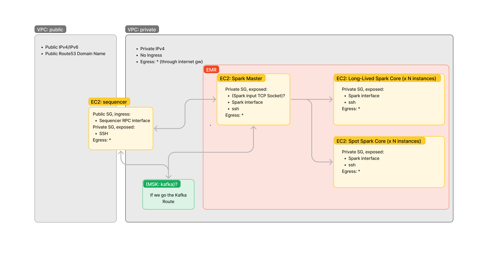

# Ops Architecture

## Top-Level Diagram

Some Remarks:

- The final Spark topology (ie. How many core nodes do we need? What core nodes EC2 instance type should we use?) is eluded from this document and will be determined after the benchmark phase. This is by no means a trivial problem, but it's really hard to make an informed decision without being able to run the real payload.
- The Sequencer machine get two network interfaces: one on the public VPC to receive the ingress, one in the private VPC to communicate with the Spark cluster.
- The communication between the Sequencer and the Spark master node either happens through a direct TCP socket (through the private VPC), or through a Kafka topic. See the next section for more details.
- The Spark-related EC2 machines system configuration is managed through EMR.
- The Sequencer EC2 system configuration is managed through a NixOS closure. The closure contains the sequencer program, launched in a sandboxed systemd unit. The closure is pushed to the remote machine through a small terraform custom provider.
- The whole infra is provisioned and configured through terraform.

## Sequencer / Spark Cluster Interaction

Note: this section is not 100% ops, it is tightly coupled with the dev side of things.

How does the Sequencer send jobs to the Spark cluster? How does the Sequencer retrieve these jobs results?

We're likely to use the [Spark structured streaming API](https://spark.apache.org/docs/latest/structured-streaming-programming-guide.html). Spark is inherently asynchronous, the structured streaming API is no exception. The synchronous Sequencer RPC API is relying on an asynchronous internal service to fulfill its requests. Meaning it needs to do some sort of bookkeeping to map the requests it sends to the Spark cluster with the responses it receives from it.

In practical terms, the Sequencer needs to store the requests it sent to some sort of LRU map in charge of coupling the request sent to the Spark cluster with the client HTTP sockets. I'm not a Golang expert, but after a quick search, it seems like this kind of data structure has [already been implemented in the wild](https://pkg.go.dev/github.com/hashicorp/golang-lru/v2). We'll probably have to regularly clean this map to remove the dead HTTP clients. Maybe there's a smarter way to approach this problem. If we keep in mind the Sequencer requests shouldn't live more than 10s, we probably can timestamp each request in the LRU map and GC the timeout ones.

In any case, this Sequencer <=> Spark interface won't be trivial to implement.

Let's explore how the Sequencer and the Spark cluster can communicate in purely practical terms. Note: I won't explore the wire format itself.

### Sequencer => Spark Cluster

We have two options for the "input" data (input from the Spark cluster point of view):

1. **UTF-8 text over a bare TCP Socket**: this is not fault-tolerant. That being said, provided the short-lived nature of the Sequencer requests, I don't think that's an issue for us. Reliability might be problematic though. What happens when one side of the socket gets closed (bug, network partition, etc.)? If we go that route, we have to make sure we can reliably recreate the socket when it gets terminated.
2. **Kafka topic**: this can be fault-tolerant, but again, I don't think it matters much for our use case. All the data stored in the queue will be short-lived, we don't need any cluster redundancy. Confluent publishes an official [golang kafka client library](https://github.com/confluentinc/confluent-kafka-go).

See https://spark.apache.org/docs/latest/structured-streaming-programming-guide.html#input-sources for more information.

### Spark Cluster => Sequencer

We have also two options:

1. **Foreach sink**: that's a fancy name for "custom sink". Only make sense if we decide not to go with Kafka. In that case, we'd create another TCP socket for output data.
1. **Kafka sink**: see previous section.

https://spark.apache.org/docs/latest/structured-streaming-programming-guide.html#output-sinks for more details.

Overall, the Spark => Sequencer communication will depend on the choice we made for the Sequencer => Spark pipeline. If we chose Kafka one way, we'll keep on relying on Kafka the other way around.

### Decision Time

Operationally wise, the bare socket would make more sense: losing the in-process data is not a big deal for us, and using a bare socket maintains complexity to a bare minimum. I'm a bit worried with the reliability story of this option though. We don't have much control over the reconnection behavior on the Spark side. We'll have to rely on their `ssc.socketTextStream` implementation, as far as I know, we can't customize that. If we go that route, we'll have to extensively test the interface between the Sequencer and the Spark Cluster and make sure that losing the socket won't bring down the whole system.

Kafka is a different beast. Operationally wise, the complexity goes through the roof. Reliability wise, we can be sure that temporarily losing the connection with the Kafka client is going to be properly handled.

AWS has a managed offer (MSK) for such a Kafka cluster. That could ease the pain if we decide to go that route.
